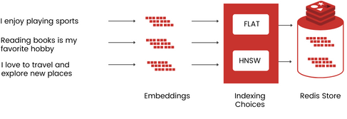
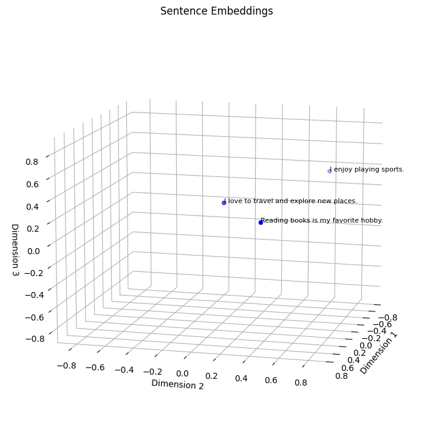

# Vector Embeddings

Vector embeddings are numerical representations of unstructured data, such as text, images, or audio, in the form of vectors (lists of numbers). These embeddings capture the semantic similarity of objects by mapping them to points in a vector space, where similar objects are represented by vectors that are close to each other.

## Why vector embeddings?

Vector embeddings have various applications in machine learning. They can be used for tasks like clustering, recommendation systems, and classification. In clustering, objects with similar characteristics are grouped together based on the proximity of their embeddings. Recommendation systems utilize vector embeddings to find similar objects and provide personalized recommendations. In classification, the labels of unseen objects can be determined by considering the labels of the most similar objects based on their embeddings.

## Creating Vector Embeddings

There are different approaches to creating vector embeddings. One method to generate vector embeddings involves feature engineering, where domain knowledge is utilized to define the vector values based on specific features of the objects. For example, in image vectors, pixel values can be used, or in explicit feature vectors, specific feature values are defined. However, this approach can be time-consuming and not scalable. Alternatively, newer techniques involve training Language Models (LLMs) to generate vector embeddings for objects using deep neural networks. State-of-the-art models like [Word2Vec](https://code.google.com/archive/p/word2vec/), [GLoVE](https://nlp.stanford.edu/projects/glove/), [BERT](https://github.com/google-research/bert), OpenAI's [GPT-3](https://openai.com/research/gpt-3), Cohere's [Sentence Transformers](https://cohere.ai/), and Hugging Face's [Transformers](https://huggingface.co/models) have been widely used for text-to-vector embedding transformations.

These models offer advanced techniques to generate high-dimensional vector embeddings for text data, enabling more accurate representation and understanding of semantic relationships between sentences.

Let's create a vector embedding example with a few sentences plotted on a 3D plot. Again, we will use the Universal Sentence Encoder (USE) to generate sentence embeddings. The USE model converts each sentence into a fixed-length vector representation.

Here are three example sentences and their corresponding embeddings:
```
Sentence: "I enjoy playing sports."
Embedding: [0.2, 0.8, 0.6]

Sentence: "Reading books is my favorite hobby."
Embedding: [0.9, 0.5, 0.3]

Sentence: "I love to travel and explore new places."
Embedding: [0.7, 0.2, 0.4]
```



Now, let's plot these sentence embeddings on a 3D plot:



## References

Vector embeddings have a wide range of practical uses and applications. One of the key applications is similarity search, where algorithms like K-nearest neighbors (KNN) or approximate nearest neighbors (ANN) are employed to measure the distances between embeddings. By determining the similarity based on these distances, various tasks can be accomplished, including de-duplication (identifying and eliminating duplicates), recommendations (finding similar items or content), anomaly detection (identifying outliers or unusual patterns), and reverse image search (finding similar images based on their embeddings).

In addition to their applications in similarity search, vector embeddings are also utilized internally in many machine learning models and methods. For instance, encoder-decoder architectures used in tasks like machine translation and caption generation rely on vector embeddings. These architectures involve transforming input data into meaningful and compact representations (embeddings) using an encoder, which is then decoded to generate the desired output. By leveraging vector embeddings, these models can capture and understand the underlying structure and relationships within the data, enabling effective translation and captioning capabilities.

---

In summary, vector embeddings provide a powerful way to represent and compare objects in machine learning tasks, allowing for the quantification of semantic similarity and supporting a wide range of applications across different domains.

---
