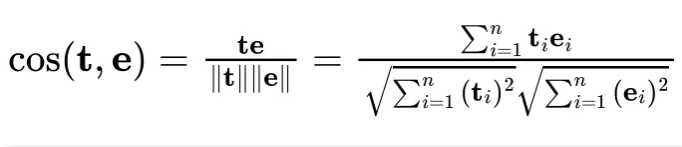
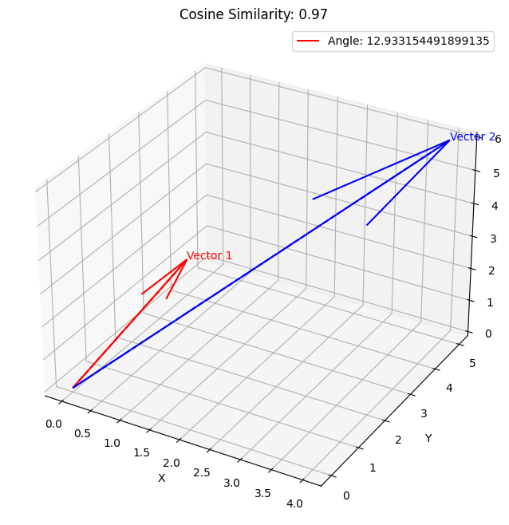
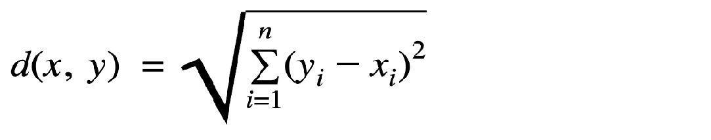
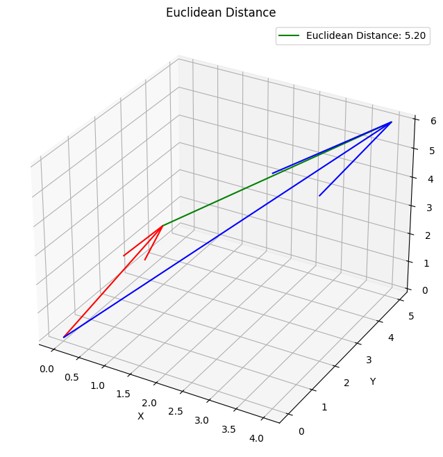

# Distance Metrics

In the context of a Vector Database, a Distance Metric refers to a mathematical function that takes two vectors as an input parameter and computes a distance value representing their similarity or dissimilarity. The primary purpose of these metrics is to determine how close or distant the two vector embeddings are from each other.

## What underlies the presence of multiple distance metrics?

The dimensionality of [Vector Embeddings](VectorEmbeddings.md) used in Machine Learning models can vary widely, ranging from around 100 dimensions to even thousands of dimensions.

Calculating the distance between two vectors becomes increasingly time-consuming as the number of dimensions increases. Additionally, certain distance metrics require more computational resources than others. This can pose a challenge when dealing with high-dimensional vectors.

To address this challenge, various distance metrics have been developed to strike a balance between speed and accuracy in calculating distances between vectors. These metrics aim to provide efficient and reliable methods for measuring the similarity or dissimilarity between vectors, particularly in scenarios involving high-dimensional data.

Redis employs three distance measures to gauge the similarity of vectors. Selecting an effective distance measure considerably enhances classification and clustering performance.

## Cosine similarity

Cosine similarity is a measure that determines the angle between two vectors in a multi-dimensional space. It operates on the premise that vectors pointing in similar directions are considered similar. This metric finds significant applications in Natural Language Processing (NLP). It enables the assessment of document similarity regardless of their magnitude. This is advantageous because even if two documents are far apart in terms of Euclidean distance, they can still be considered similar if their angle is small.

The formula for Cosine Similarity is as follows:

Cosine Similarity is the preferred metric for measuring the distance between vectors. This distance metric is widely used due to its suitability for continuous data and its significant utility in various applications.

The following 3D graph illustrates the visualization of distance metrics in vector spaces

## Euclidean distance (L2)

Euclidean distance essentially counts the length of a line between two points.

The formula for Euclidean distance is as follows:

where **x** = (x1, x2,..., xn) and **y** = (y1, y2,..., yn) are two points in n-dimensional Euclidean space

The following 3D graph illustrates the visualization of distance metrics in vector spaces

