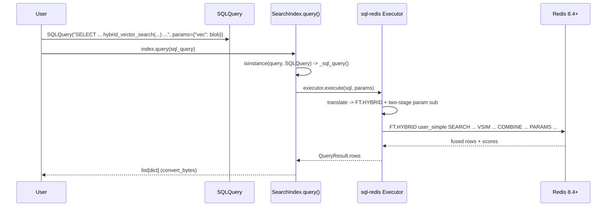

# Spec: `hybrid_vector_search()` in RedisVL `SQLQuery`

**Jira:** [RAAE-1322](https://redislabs.atlassian.net/browse/RAAE-1322) ·
**Status:** Draft ·
**Requires:** Redis 8.4+, redis-py >= 7.1.0, `sql-redis` (with `FT.HYBRID` support) ·
**Companion:** `sql-redis` core spec at `applied-ai/sql-redis/docs/proposals/ft-hybrid.md`

# Goal

Let a RedisVL user run server-side hybrid fusion (`FT.HYBRID`) through the familiar
`SQLQuery` surface, by writing a `hybrid_vector_search(...)` SELECT function. The SQL is
translated by `sql-redis` into an `FT.HYBRID` command, executed through the existing
`index.query(...)` path, and returned as plain rows. The result must be consistent with
RedisVL's native `HybridQuery` so a user can move between the SQL and object APIs without
surprises.

Hard constraint: do not fork hybrid semantics. RedisVL already has a native `HybridQuery`
([`redisvl/query/hybrid.py`](../../redisvl/query/hybrid.py)) that maps to `FT.HYBRID` via
`index.hybrid_search()`. `SQLQuery.hybrid_vector_search()` is a SQL front-end to the **same**
capability and must reuse the same parameter vocabulary and result parsing.

# Flow



# What changes, and what does not

**No execution code change in RedisVL.** `index.query()` already dispatches `SQLQuery` to
`_sql_query()` ([`redisvl/index/index.py`](../../redisvl/index/index.py)), which calls
`executor.execute(sql, params)` and returns `result.rows`. Once `sql-redis` emits and
parses `FT.HYBRID`, this path carries hybrid rows unchanged. The work in `sql-redis` is
tracked in the companion spec.

**RedisVL surface work (this spec):**

1. **Docstrings.** Document `hybrid_vector_search(...)` in
   [`redisvl/query/sql.py`](../../redisvl/query/sql.py) `SQLQuery`, alongside the existing
   `fulltext` / `fuzzy` / `cosine_distance` notes, with the Redis 8.4 / redis-py 7.1.0
   requirement.
2. **Parameter parity.** Ensure the `hybrid_vector_search()` options map 1:1 onto the native
   `HybridQuery` arguments (table below) so both surfaces produce equivalent commands.
3. **Version guard message.** `SQLQuery` should surface a clear error when the server or
   redis-py is too old, mirroring `HybridQuery`'s
   `"Hybrid queries require Redis >= 8.4.0 and redis-py>=7.1.0"`.
4. **User guide.** Add a "Hybrid fusion" section to
   [`docs/user_guide/12_sql_to_redis_queries.ipynb`](../user_guide/12_sql_to_redis_queries.ipynb),
   reusing the existing `user_simple` index, and cross-link the native `HybridQuery`
   example in `11_advanced_queries.ipynb`.

# End-user example

Reuses the `user_simple` index from the SQL-to-Redis user guide (text field
`job_description`, vector field `job_embedding`):

```python
from redisvl.query import SQLQuery
from redisvl.index import SearchIndex

index = SearchIndex.from_dict(schema, redis_url="redis://localhost:6379")

vec = hf.embed("use base principles to solve problems", as_buffer=True)

sql_query = SQLQuery(
    """
    SELECT user, job, job_description,
           hybrid_vector_search(
               cosine_distance(job_embedding, :vec),
               fulltext(job_description, 'use base principles to solve problems'),
               linear(alpha => 0.3)
           ) AS hybrid_score
    FROM user_simple
    WHERE region = 'us-central'
    ORDER BY hybrid_score DESC
    LIMIT 10
    """,
    params={"vec": vec},
)

# Inspect the generated command
print(sql_query.redis_query_string(redis_url="redis://localhost:6379"))
# FT.HYBRID user_simple SEARCH "@job_description:(...) (@region:{us\-central})" SCORER BM25STD
#   VSIM @job_embedding $vec FILTER 1 "@region:{us\-central}" KNN 2 K 10
#   COMBINE LINEAR 4 ALPHA 0.3 BETA 0.7 WINDOW 20 YIELD_SCORE_AS hybrid_score
#   LOAD 3 user job job_description LIMIT 0 10 PARAMS 2 vec <bytes> DIALECT 2

results = index.query(sql_query)
```

# Parameter parity with native `HybridQuery`

The SQL function options must map onto the existing `HybridQuery` arguments so the two
surfaces stay coherent. Defaults are taken from `HybridQuery`.

| `HybridQuery` arg | Default | `hybrid_vector_search(...)` equivalent |
|---|---|---|
| `text`, `text_field_name` | required | `fulltext(text_field, 'query')` |
| `vector`, `vector_field_name` | required | `cosine_distance(vec_field, :vec)` |
| `vector_param_name` | `"vector"` | the `:param` name in the SQL |
| `text_scorer` | `BM25STD` | `fulltext(..., scorer => 'BM25STD')` |
| `vector_search_method` | `None` (KNN) | `cosine_distance(...)` (KNN) or `vector_range(...)` (RANGE) |
| `knn_ef_runtime` | `10` | `cosine_distance(..., ef_runtime => 10)` |
| `range_radius`, `range_epsilon` | none, `0.01` | `vector_range(..., radius => r, epsilon => e)` |
| `combination_method` | server default RRF | `rrf(...)` / `linear(...)` (third arg) |
| `rrf_window`, `rrf_constant` | `20`, `60` | `rrf(window => 20, constant => 60)` |
| `linear_alpha` | `0.3` (beta = 1 - alpha) | `linear(alpha => 0.3)` |
| `num_results` | `10` | `LIMIT n` |
| `return_fields` | `None` | the `SELECT` column list |
| `filter_expression` | `None` | the `WHERE` clause |
| `yield_combined_score_as` | `None` | `hybrid_vector_search(...) AS hybrid_score` |
| `yield_text_score_as` / `yield_vsim_score_as` | `None` | `fulltext(..., yield_score_as => ...)` / `cosine_distance(..., yield_score_as => ...)` |

# Things to consider

- **Single source of result parsing.** Prefer that `sql-redis`'s executor reuse redis-py's
  `hybrid_search` reply parsing (the same path `HybridQuery` relies on) rather than
  hand-rolling. That keeps the two RedisVL surfaces returning identically shaped rows.
- **Alternative: translate to a native `HybridQuery`.** Instead of `sql-redis` executing
  `FT.HYBRID` directly, `SQLQuery` could detect `hybrid_vector_search(...)`, extract the params,
  and build a native `HybridQuery`, reusing all existing plumbing. This avoids duplicating
  execution/parsing but splits translation across packages and diverges from how `SQLQuery`
  handles every other statement (delegating fully to `sql-redis`). Recommend keeping
  `sql-redis` self-contained and revisiting only if reply parsing proves duplicative.
- **`redis_query_string()` for hybrid.** This helper calls
  `executor._translator.translate(sql).to_command_string()`. Confirm `to_command_string()`
  renders `FT.HYBRID` (multi-clause) correctly for the "inspect the command" workflow shown
  throughout the user guide.
- **stopwords.** Native `HybridQuery` strips query-time stopwords client-side
  (default `"english"`). `sql-redis` already strips default stopwords for `fulltext`/phrase
  search and warns. Confirm the two behave the same for the hybrid text leg so results match.
- **`LINEAR` alpha/beta.** Decided: v1 exposes `alpha` only and derives `beta = 1 - alpha`,
  exactly matching native `HybridQuery`. So `linear(alpha => 0.3)` and
  `HybridQuery(combination_method="LINEAR", linear_alpha=0.3)` produce the same command.
- **Version gating UX.** Decide whether the guard fires at `SQLQuery` construction, at
  `redis_query_string()`, or at `index.query()` (where the server version is known). The
  last is the only place the server version is reliably available.
