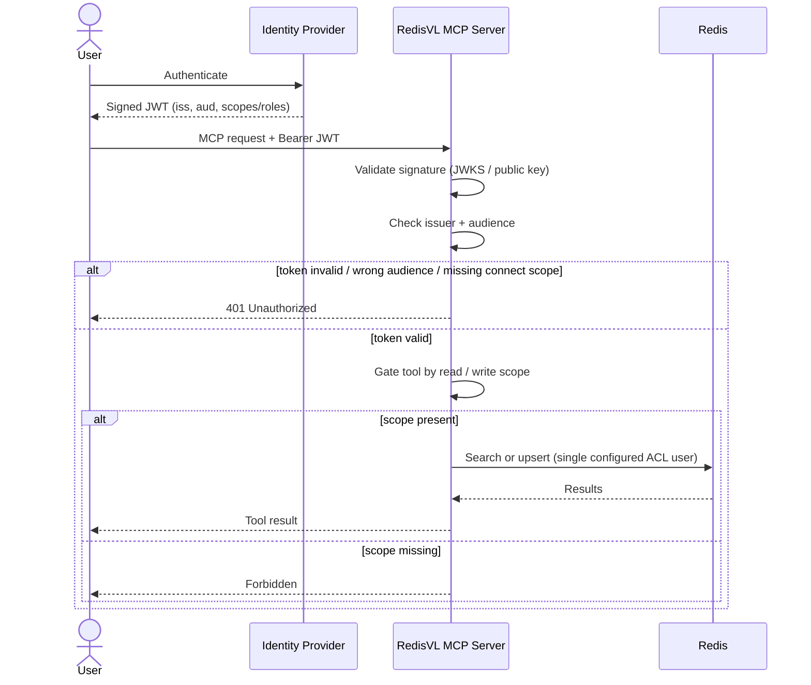
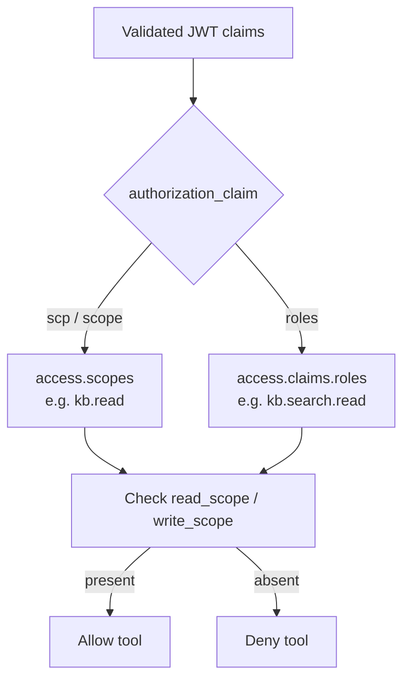
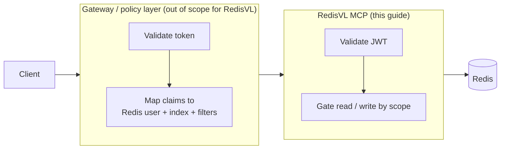

---
myst:
  html_meta:
    "description lang=en": |
      How RedisVL MCP authenticates clients with JWT bearer tokens and gates
      read vs write access by scope or role claim.
---

# Authenticate RedisVL MCP

This guide explains how the RedisVL MCP server authenticates clients on its HTTP
transports and how it gates read vs write access. It also draws the boundary
between what RedisVL enforces and what belongs in a gateway or policy layer.

```{note}
Authentication applies only to the HTTP transports (`streamable-http`, `sse`).
The `stdio` transport is a local subprocess with no network surface and is never
authenticated.
```

## What RedisVL Enforces

RedisVL validates a bearer **JWT** that an existing identity provider (IdP)
issued. It does not run an OAuth authorization server and does not issue tokens.

On each request it checks:

- **Signature**, against a JWKS endpoint or a static public key.
- **Issuer** (`iss`), so only tokens from your IdP are accepted.
- **Audience** (`aud`), so a token minted for a different service cannot be
  replayed against this server (RFC 8707).
- **Required scopes** to connect, and (optionally) a **read scope** to call
  `search-records` and a **write scope** to call `upsert-records`.

```{important}
This is **coarse** authorization: it decides whether a caller may connect and
whether it may read or write. It does **not** map token claims to a Redis ACL
user, a per-tenant index, or query filters. See [The Authorization Boundary](#the-authorization-boundary).
```

## Request Flow



## Configure JWT Authentication

Add a `server.auth` block to your MCP config. Secrets can be injected with
`${ENV}` substitution.

```yaml
server:
  redis_url: ${REDIS_URL:-redis://localhost:6379}
  auth:
    type: jwt
    jwks_uri: ${MCP_JWKS_URI}          # or set public_key for a static key
    issuer: ${MCP_ISSUER}
    audience: api://redisvl-mcp
    required_scopes: [kb.read]         # required to connect
    read_scope: kb.search.read         # required for search-records
    write_scope: kb.search.write       # required for upsert-records

indexes:
  knowledge:
    redis_name: docs_index
    search:
      type: fulltext
    runtime:
      text_field_name: content
```

Every field is also settable through `REDISVL_MCP_AUTH_*` environment variables,
which take precedence over the YAML block.

## Choosing the Authorization Claim

Different identity providers carry authorization in different claims. The
default JWT scope claim is `scp` (or `scope`). Some enterprise providers carry
authorization in a **`roles`** claim instead, which does not appear in the
standard scope set.



Set the claim that holds your authorization values so read and write gating
reads the right place:

```yaml
server:
  auth:
    type: jwt
    # ...
    authorization_claim: roles   # default: scp
    read_scope: kb.search.read
    write_scope: kb.search.write
```

A token like the following would then pass the read gate, because
`kb.search.read` is present in `roles`:

```jsonc
{
  "iss":   "https://your-idp.example/{tenant}/v2.0",
  "aud":   "api://redisvl-mcp",
  "sub":   "nitin",
  "roles": ["kb.search.read"],
  "scp":   "kb.read"
}
```

## The Authorization Boundary

RedisVL MCP authenticates the caller and gates read vs write. It does **not**
translate token claims (such as a tenant id or role) into a specific Redis ACL
user, a per-tenant index, or injected query filters. The server holds one Redis
connection for one index, established at startup.

Fine-grained, per-tenant data isolation belongs in a **gateway or policy layer**
in front of the MCP server, which validates the token, looks up a binding of
claim to Redis identity, and injects credentials and filters.



Use RedisVL's JWT validation for authentication and coarse read/write
authorization. Layer a gateway on top when you need per-tenant Redis ACL
enforcement.

## See Also

- {doc}`mcp`: run and configure the RedisVL MCP server.
```
