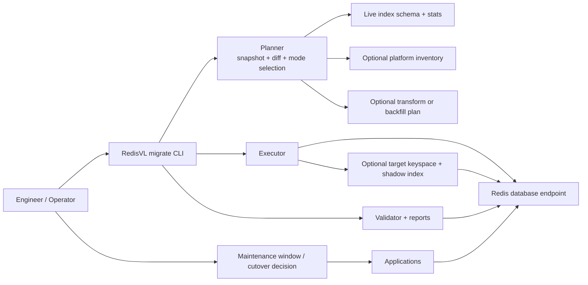

# Product Requirements Document: RedisVL Index Migrator

> **Status**: Phase 1 is implemented and shipped (PRs #567-#572). This PRD has been updated with implementation notes where the shipped product diverged from the original requirements.

## Summary

RedisVL now has a migration workflow for search index changes that is safer and more operationally predictable than ad hoc scripts, while remaining simple enough to build, review, and operate without introducing an orchestration-heavy subsystem.

This PRD defines a phased migration product:

- Phase 1: `drop_recreate` - **Done**
- Phase 2: `iterative_shadow` - Planned

The overall product goal is broader than the MVP. The migrator should eventually handle not only simple schema changes, but also vector datatype, precision, dimension, algorithm, and payload-shape-changing migrations such as:

- `HNSW -> FLAT`
- `FP32 -> FP16`
- vector dimension changes
- embedding or payload-shape changes that require new stored fields or a new target keyspace

Phase 1 stays intentionally narrow so the team can ship a plan-first, document-preserving migration tool quickly. Phase 2 is where those harder migrations are handled safely through one-index-at-a-time shadow migration and optional transform or backfill.

This document is the review-oriented summary of the detailed planning docs in this workspace.

## Problem

RedisVL today gives users index lifecycle primitives, not a migration product.

Users can:

- create indexes
- delete indexes
- inspect index information
- load documents

Phase 1 addressed the following gaps (users can now):

- preview a schema migration in a structured way (`rvl migrate plan`)
- preserve current index configuration before change (`source` snapshot in plan)
- apply only a requested subset of schema changes (`schema_patch.yaml`)
- generate a repeatable migration plan artifact (`migration_plan.yaml`)
- validate a migration with a consistent report (`rvl migrate validate`)
- estimate migration duration, query impact, or memory impact from benchmarkable outputs (`migration_report.yaml`, `benchmark_report.yaml`)
- perform vector quantization (e.g., FP32 -> FP16) with crash-safe reliability

Still not addressed (Phase 2):

- shadow migrations that require running old and new indexes in parallel

This gap is manageable for small experiments, but becomes painful for production workloads where:

- indexes can contain millions of documents
- query latency matters during rebuild windows
- teams need predictable maintenance timelines
- migrations may change vector algorithms, datatypes, or payload shape
- Redis deployments may be clustered on Redis Cloud or Redis Software
- operators need a clean handoff between planning, execution, and validation

## Users and Review Audience

Primary users:

- application engineers managing RedisVL-backed indexes
- platform engineers responsible for Redis operations
- support or solution engineers helping customers plan schema migrations

Review audience:

- RedisVL maintainers
- product and engineering stakeholders
- operators who will validate whether the workflow is practical in real environments

## Goals

- Provide a first-class migration workflow for RedisVL-managed indexes.
- Preserve existing documents during the Phase 1 path.
- Capture current schema and index configuration before any mutation.
- Apply only requested schema changes.
- Require a reviewed migration plan before execution.
- Support both scripted and guided user experiences.
- Make downtime and disruption explicit.
- Add structured reports and benchmarking outputs so migration windows become more predictable over time.
- Add benchmarking for memory and size deltas caused by schema, vector, and payload-shape changes.
- Keep the implementation simple enough that another engineer can understand and modify it quickly.

## In Scope

### Product-Wide Scope

- schema-change migrations for RedisVL-managed indexes
- vector datatype, precision, dimension, and algorithm migrations
- payload-shape-changing migrations when the operator provides an explicit transform or backfill plan
- YAML artifacts for plans and reports
- operator-readable console output
- one-index-at-a-time execution
- benchmarking outputs for timing, query impact, and memory or size deltas

### Phase 1 MVP

- one index at a time
- document-preserving `drop_recreate` migrations
- source schema and stats snapshot
- patch-based schema change requests
- target-schema diff normalization into the same patch model
- guided wizard and scripted CLI flows
- plan generation before any mutation
- explicit downtime acknowledgment for `apply`
- readiness waiting after recreate
- validation and reporting
- benchmark-friendly timing, correctness, and index-footprint outputs

### Phase 2

- one-index-at-a-time `iterative_shadow` migrations
- conservative capacity gating before each index
- optional platform inventory input
- shadow target creation and validation
- `shadow_reindex` for payload-compatible migrations
- `shadow_rewrite` for vector or payload-shape-changing migrations
- explicit transform or backfill plan input when payload shape changes
- operator handoff for cutover
- benchmark outputs for ETA, peak overlap, and source-versus-target size deltas

## Out of Scope

- automatic traffic cutover
- automatic platform scaling
- concurrent migration of multiple large indexes
- fully managed rollback orchestration
- full key manifest capture by default
- platform API integration as a hard requirement
- automatic transform inference
- automatic embedding generation or automatic re-embedding inside the migrator
- in-place destructive payload rewrites without a shadow target

## Product Principles

- Prefer simple and safe over fully automated.
- Reuse existing RedisVL primitives before adding new layers.
- Make the plan artifact the center of the workflow.
- Treat operator actions as first-class, not hidden implementation details.
- Fail closed when a migration request is ambiguous or unsupported for the selected phase.
- Measure migration behavior so future planning gets better with evidence.

## Current State

RedisVL already has building blocks that support a migration product:

- `SearchIndex.from_existing()` for live schema reconstruction
- `SearchIndex.delete(drop=False)` for dropping the index structure while preserving documents
- `SearchIndex.info()` for live index stats that can inform planning, validation, and timing

What is missing is the product layer on top:

- a migration planner
- schema patch normalization and diff classification
- migration-specific CLI commands
- guided user flow
- structured migration and benchmark artifacts
- a capacity-aware future mode for larger production environments
- transform or backfill planning for migrations that change payload shape

## Proposed Product

### Phase 1 MVP: `drop_recreate`

Scope:

- one index at a time
- preserve documents
- snapshot source schema and stats
- accept `schema_patch.yaml`, `target_schema.yaml`, or wizard answers
- normalize all inputs into the same plan model
- classify requested changes as supported or blocked
- generate `migration_plan.yaml`
- require explicit downtime acknowledgment for `apply`
- drop only the index structure
- recreate the index using the merged schema
- wait for readiness
- validate and emit `migration_report.yaml`
- optionally emit `benchmark_report.yaml`

Supported changes:

- add non-vector fields backed by existing document data
- remove fields
- adjust supported non-vector index options where stored payload shape does not change
- adjust index-level options that do not relocate or rewrite data

Blocked (still):

- key separator changes
- storage type changes (hash <-> JSON)
- JSON path remodels
- vector dimension changes
- any change requiring a completely new stored payload shape

> **Implementation note**: The following were originally blocked in this PRD but were implemented:
> - ~~key prefix changes~~ - supported via `index.prefix` in schema patch
> - ~~field renames~~ - supported via `rename_fields` in schema patch
> - ~~vector datatype changes~~ - supported as in-place quantization
> - ~~index name changes~~ - supported via `index.name` in schema patch

### Phase 2: `iterative_shadow`

Scope:

- one index at a time
- conservative capacity gate before each index
- optional `platform_inventory.yaml`
- optional `transform_plan.yaml` when payload shape changes
- shadow target creation
- readiness waiting and validation
- operator-owned cutover
- old index retirement after operator confirmation
- optional old-payload retirement after operator confirmation
- structured benchmark outputs for overlap timing, ETA accuracy, and memory or size deltas

Execution submodes:

- `shadow_reindex`
  - use when the new index can be built from the current stored payload
  - still useful for lower-disruption rebuilds when the payload shape does not change
- `shadow_rewrite`
  - use when vector datatype, precision, dimension, algorithm, or payload shape changes require a new target payload or keyspace
  - examples: `HNSW -> FLAT`, `FP32 -> FP16`, dimension changes, new embedding schema

Still intentionally excluded:

- automatic cutover
- automatic scaling
- concurrent shadowing of multiple large indexes
- transform inference

## Architecture

The product should work as a plan-first migration workflow with explicit operator handoff and an optional transform path for harder migrations.



Architecture expectations:

- RedisVL owns planning, execution, validation, and artifact generation.
- Redis remains the system of record for source documents and index state.
- The operator owns maintenance windows, scaling, transform inputs, and application cutover decisions.
- The product must stay compatible with single-node and clustered deployments without assuming the whole index lives on one shard.

## Why the Work Is Phased

The product is phased because the migration strategies solve different problems:

- `drop_recreate` is the fastest path to a usable, understandable MVP
- `iterative_shadow` is the future path for tighter operational control and safer handling of vector or payload-shape changes

Trying to ship everything as one fully mature product would push the team into:

- premature capacity-estimation complexity
- premature transform-runtime design
- premature cutover abstractions
- premature platform-specific automation
- a larger QA and support surface before the MVP proves value

Phase 1 is therefore the implementation target, while Phase 2 remains planned work informed by Phase 1 learnings.

## User Experience

### Scripted Flow (as shipped)

```text
rvl migrate plan --index <name> --schema-patch <patch.yaml>
rvl migrate plan --index <name> --target-schema <schema.yaml>
rvl migrate apply --plan <migration_plan.yaml> [--async] [--resume <checkpoint.yaml>]
rvl migrate validate --plan <migration_plan.yaml>
rvl migrate estimate --plan <migration_plan.yaml>
```

### Guided Flow (as shipped)

```text
rvl migrate wizard --index <name> --plan-out <migration_plan.yaml>
```

### Batch Flow (as shipped)

```text
rvl migrate batch-plan --schema-patch <patch.yaml> --pattern '*_idx'
rvl migrate batch-apply --plan <batch_plan.yaml> --accept-data-loss
rvl migrate batch-resume --state <batch_state.yaml> --retry-failed
rvl migrate batch-status --state <batch_state.yaml>
```

User experience requirements (verified in implementation):

- `plan` never mutates Redis
- `wizard` emits the same plan artifact shape as `plan`
- `apply` only accepts a reviewed plan file
- `apply` requires `--accept-data-loss` when quantization is involved
- `validate` is usable independently after `apply`
- console output is concise and operator-readable
- blocked requests tell the user what is not supported

## Usage

### Phase 1: `drop_recreate`

Review-first workflow:

```text
rvl migrate plan --index products --schema-patch patch.yaml --plan-out migration_plan.yaml
rvl migrate apply --plan migration_plan.yaml --report-out migration_report.yaml
rvl migrate validate --plan migration_plan.yaml --report-out migration_report.yaml
```

Guided workflow:

```text
rvl migrate wizard --index products --plan-out migration_plan.yaml
rvl migrate apply --plan migration_plan.yaml
```

Expected usage pattern:

1. Generate a plan from a live source index.
2. Review blocked diffs, warnings, downtime notice, and merged target schema.
3. Run `apply` only after the operator accepts the maintenance window.
4. Run `validate` and retain the report as the handoff artifact.

### Phase 2: `iterative_shadow`

Payload-compatible shadow workflow:

```text
rvl migrate plan --mode iterative_shadow --index products --schema-patch patch.yaml --platform-inventory platform_inventory.yaml --plan-out migration_plan.yaml
rvl migrate apply --plan migration_plan.yaml --report-out migration_report.yaml
```

Payload-rewrite shadow workflow:

```text
rvl migrate plan --mode iterative_shadow --index products --target-schema target_schema.yaml --platform-inventory platform_inventory.yaml --transform-plan transform_plan.yaml --plan-out migration_plan.yaml
rvl migrate apply --plan migration_plan.yaml --report-out migration_report.yaml
```

Expected usage pattern:

1. Provide the schema request and platform inventory.
2. Provide `transform_plan.yaml` when the target payload shape changes.
3. Review the capacity-gate outcome, estimated migration window, and estimated peak overlap footprint.
4. Run the shadow migration for one index only.
5. Hand cutover to the operator.
6. Confirm cutover before retiring the old index and any obsolete payloads.

## Artifacts

Required artifacts:

- `migration_plan.yaml`
- `migration_report.yaml`

Optional or phase-dependent artifacts:

- `benchmark_report.yaml`
- `platform_inventory.yaml`
- `transform_plan.yaml`
- `benchmark_manifest.yaml`

Artifact requirements:

- YAML-based
- stable enough for handoff and review
- readable by humans first
- structured enough for future automation

## Operational Model

RedisVL owns:

- source snapshot
- schema diffing
- plan generation
- supported strategy execution
- readiness waiting
- validation
- reporting

Operators own:

- maintenance windows
- application behavior during migration
- platform scaling
- transform inputs for payload-shape changes
- cutover
- final go or no-go decisions in production

The product should not imply that RedisVL is a full migration control plane. It is a migration toolset with explicit operator handoff.

## Capacity and Scale

Phase 1 keeps capacity handling simple:

- use source index stats for warnings
- capture timing and impact for later planning
- avoid a complex estimator in the MVP

Phase 2 introduces a conservative planner:

- reason at the database level, not as “an index lives on one shard”
- treat each index as one logical distributed index even on sharded deployments
- estimate source document footprint and source index footprint separately
- estimate target document footprint and target index footprint separately
- compute peak overlap as the source footprint plus the target footprint that exists during migration
- require reserve headroom before apply
- return `READY`, `SCALE_REQUIRED`, or `MANUAL_REVIEW_REQUIRED`

The execution rule stays simple across both phases:

- one index at a time

This is the core design choice that keeps the system understandable at production scale.

## Downtime and Disruption

Phase 1 explicitly accepts downtime.

Expected impacts:

- search on the affected index is unavailable between drop and recreated index readiness
- query quality may be degraded while initial indexing completes
- shared Redis resources are consumed during rebuild
- large indexes need maintenance windows or application-level degraded mode handling

Phase 2 aims to reduce disruption, but it still has operational costs:

- old and new index structures overlap during migration
- payload-rewrite migrations may also duplicate payloads temporarily
- memory and size can either grow or shrink depending on datatype, precision, dimension, algorithm, and payload-shape changes

These are product facts and must be visible in the plan and report artifacts.

## Benchmarking and Success Metrics

Benchmarking is a product requirement, not an afterthought.

The product should help answer:

- how long planning takes
- how long apply takes
- how long downtime or overlap lasts
- how much document throughput the migration achieves
- how query latency changes during the migration window
- how much memory and size change between source and target
- how accurate the peak-overlap estimate was

Core success metrics:

- migration plan generation succeeds for supported diffs
- unsupported diffs are blocked before mutation
- Phase 1 preserves documents
- Phase 2 produces deterministic shadow plans for supported vector and payload-shape migrations
- schema match and document count match succeed after migration
- reports include stable timing, correctness, and memory-delta metrics
- benchmark rehearsals are good enough to estimate future maintenance windows and scaling decisions with confidence

## Functional Requirements

- plan generation from live index plus requested schema changes
- schema patch normalization
- supported-versus-blocked diff classification
- guided wizard for supported Phase 1 changes
- explicit downtime acknowledgment in Phase 1
- structured plan, report, and benchmark outputs
- validation of schema, counts, and indexing-failure deltas
- one-index-at-a-time execution
- Phase 2 capacity-gated shadow planning
- Phase 2 support for vector and payload-shape migrations through explicit shadow planning

## Non-Functional Requirements

- deterministic plan outputs
- human-readable YAML artifacts
- clear failure modes
- conservative defaults
- no document deletion by the Phase 1 migrator path
- reasonable operation on large indexes without default full-key manifests
- documentation detailed enough for implementation handoff

## Risks

- Users may assume unsupported Phase 1 schema changes should “just work” unless the diff classifier clearly routes them to Phase 2.
- Operators may underestimate downtime for large indexes unless benchmark outputs become part of the review flow.
- Phase 2 can grow too complex if transform logic or platform-specific automation is pulled in too early.
- Capacity estimation may be wrong unless benchmark data and observed footprint deltas are captured consistently.
- Validation may be treated as optional unless the CLI and reports make it central to the workflow.

## Rollout Plan

### Phase 1 - **Done**

- ~~finalize docs and task list~~ Done
- ~~implement the planner, diff classifier, CLI flow, executor, and validator~~ Done (PRs #567-#572)
- ~~add CI coverage for supported and blocked migration paths~~ Done
- ~~run at least one benchmark rehearsal~~ Done (see 05_migration_benchmark_report.md)

### Phase 1.5 - **Done**

- ~~review real implementation learnings~~ Done
- ~~update the planning workspace~~ Done (this update)
- Phase 2 assumptions still hold; shadow migrations remain the right approach for incompatible changes

### Phase 2

- implement inventory parsing
- implement transform or backfill plan modeling
- implement conservative capacity gating
- implement one-index-at-a-time shadow planning and execution
- add benchmark rehearsals for overlap duration, ETA accuracy, and memory-delta accuracy

## Review Questions for the Team

- Is the Phase 1 boundary narrow enough to ship quickly, but useful enough to solve real user pain?
- Is Phase 2 scoped clearly enough to own vector datatype, precision, dimension, algorithm, and payload-shape changes?
- Is operator-owned cutover still the right long-term boundary?
- Is the benchmarking scope sufficient to make migration windows and scaling decisions predictable without overbuilding a measurement subsystem?
- Does the one-index-at-a-time rule provide the right balance of simplicity and scale?

## Decision Summary

- Build the migration product in phases.
- Implement Phase 1 first and keep it intentionally narrow.
- Treat vector and payload-shape migrations as a core product goal, delivered in Phase 2 rather than ignored.
- Keep the plan artifact central to the workflow.
- Keep the operational model explicit.
- Use evidence from benchmark outputs to shape later migration planning.

## References

Detailed supporting docs in this workspace:

- [00_index.md](./00_index.md)
- [01_context.md](./01_context.md)
- [02_architecture.md](./02_architecture.md)
- [03_benchmarking.md](./03_benchmarking.md)
- [10_v1_drop_recreate_spec.md](./10_v1_drop_recreate_spec.md)
- [11_v1_drop_recreate_tasks.md](./11_v1_drop_recreate_tasks.md)
- [12_v1_drop_recreate_tests.md](./12_v1_drop_recreate_tests.md)
- [20_v2_iterative_shadow_spec.md](./20_v2_iterative_shadow_spec.md)
- [21_v2_iterative_shadow_tasks.md](./21_v2_iterative_shadow_tasks.md)
- [22_v2_iterative_shadow_tests.md](./22_v2_iterative_shadow_tests.md)

## User Journeys

### Journey 1: Application Engineer Running a Simple Schema Migration

An application engineer needs to add a new filterable metadata field to an existing index without deleting documents. They run `plan`, review the merged target schema and downtime warning, schedule a maintenance window, run `apply`, then run `validate` and hand the migration report to the team. They do not need to understand Redis internals beyond the migration inputs and the reported downtime.

### Journey 2: Platform Engineer Reviewing a Vector Precision Migration

A platform engineer needs to review a planned `FP32 -> FP16` migration for a large production index. They supply platform inventory, review the planner’s peak-overlap estimate, compare the projected post-cutover memory savings to previous benchmark reports, and decide whether the current deployment can run the migration safely in the next window.

### Journey 3: Engineer Migrating from `HNSW` to `FLAT`

An engineer wants to switch vector search behavior from `HNSW` to `FLAT` to simplify runtime performance characteristics. The planner classifies the request as a Phase 2 shadow migration, estimates the target index footprint, and produces a one-index-at-a-time plan. The operator runs the migration, validates the shadow target, and cuts traffic over once the benchmark and validation reports look acceptable.

### Journey 4: Solutions Engineer Validating a Payload-Shape Change

A solutions engineer wants to understand how long a customer migration will take when a new embedding model changes the stored payload shape. They create a `transform_plan.yaml`, run a rehearsal in non-production, collect benchmark timing, throughput, query-latency, and source-versus-target memory outputs, and use those artifacts to advise on maintenance windows and scaling needs.

## User Stories

- As an application engineer, I want to generate a migration plan before any mutation so that I can review the exact schema changes and downtime implications.
- As an application engineer, I want the Phase 1 migrator to preserve documents so that I do not have to rebuild my dataset from another source.
- As an application engineer, I want blocked Phase 1 schema changes to fail early and point me to the correct Phase 2 path so that I do not start a migration the product cannot safely complete.
- As an operator, I want migration and validation reports in YAML so that I can review, archive, and share them with other teams.
- As an operator, I want the CLI to require explicit downtime acknowledgment in Phase 1 so that maintenance-window risk is never implicit.
- As a platform engineer, I want Phase 2 to process one index at a time so that capacity planning stays understandable and bounded.
- As a platform engineer, I want the planner to estimate peak overlap and post-cutover memory deltas so that I can decide whether a migration fits safely.
- As a platform engineer, I want the shadow planner to return `READY`, `SCALE_REQUIRED`, or `MANUAL_REVIEW_REQUIRED` so that I can make a clear operational decision before execution.
- As a solutions engineer, I want benchmark outputs for duration, throughput, query impact, and memory change so that I can estimate future migrations with real evidence.
- As a maintainer, I want the migration product to reuse existing RedisVL primitives so that implementation and long-term maintenance stay simple.
