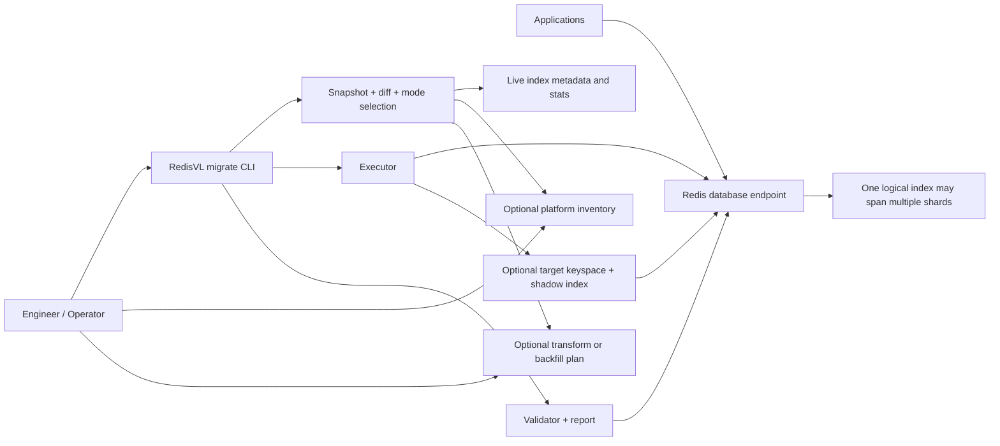
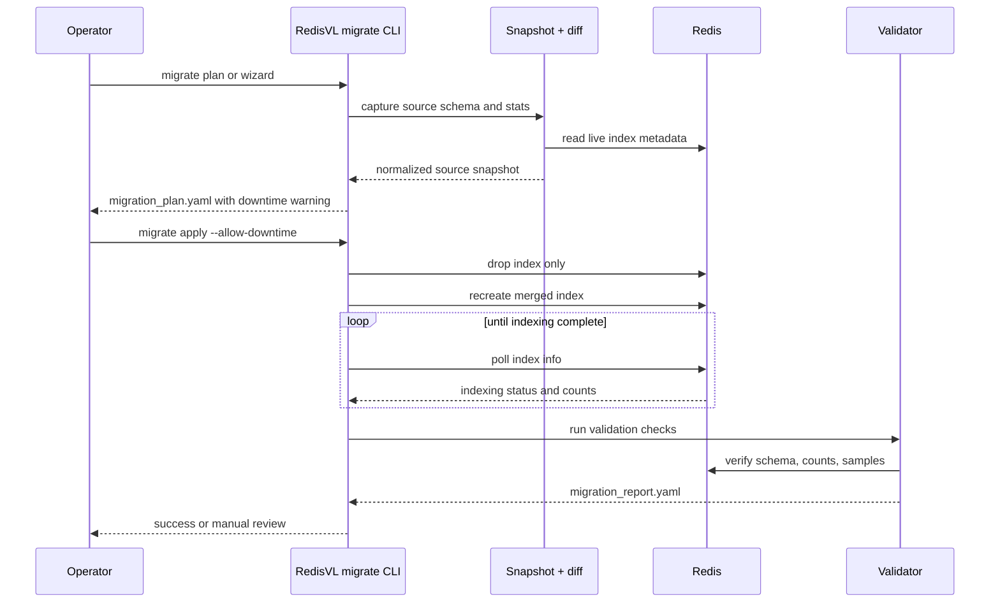
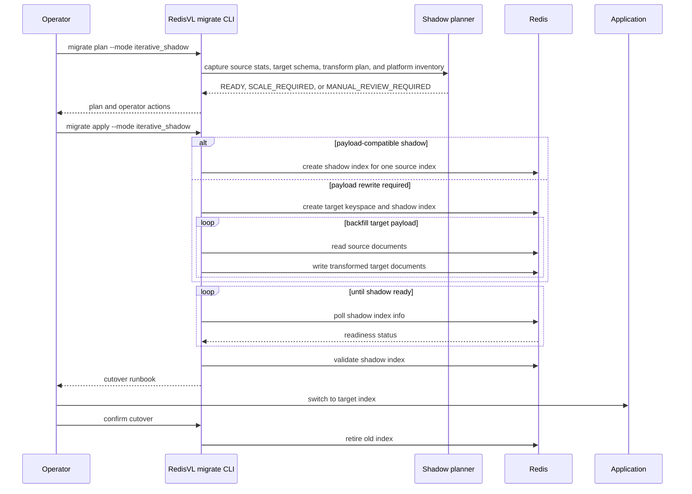

# Index Migrator Architecture

## System Boundaries

The migration system has three boundaries:

- RedisVL migration workflow: snapshot, diff, plan, apply, validate, report
- Redis deployment: Redis Cloud or Redis Software database that stores documents and indexes
- Operator and application boundary: maintenance window, scaling decisions, transform inputs, and application-level cutover behavior

The first implementation should add migration capabilities on top of existing RedisVL primitives instead of creating a separate control plane.

## Responsibilities

RedisVL should own:

- schema snapshot and source configuration capture
- schema diff classification
- migration mode selection
- migration plan generation
- guided wizard and scripted CLI entrypoints
- supported strategy execution
- validation and report generation

The operator should own:

- choosing the migration window
- accepting downtime or degraded behavior
- providing platform inventory when capacity planning matters
- providing transform or backfill inputs when payload shape changes
- scaling the Redis deployment
- application cutover and rollback decisions

The platform should be treated as an external dependency, not as part of the MVP runtime.

## Platform Model

The migrator should reason about the deployment at the database level.

For planning purposes:

- treat the database endpoint as the unit of execution
- treat a search index as one logical index even if the deployment is sharded
- do not build logic that assumes an entire index lives on a single shard
- record where data lives in terms of database, prefixes, key separators, and target keyspace plans, not physical shard pinning

This keeps the model compatible with both Redis Cloud and Redis Software without requiring the MVP to integrate directly with their platform APIs.

## Migration Modes

### `drop_recreate`

This is the Phase 1 MVP.

- Snapshot the current schema and index stats.
- Merge only the requested schema changes.
- Drop only the index structure, preserving documents.
- Recreate the index with the merged schema.
- Wait until indexing is complete.
- Validate and report.

This mode is explicit about downtime and does not attempt to preserve uninterrupted query availability.

### `iterative_shadow`

This is the planned Phase 2 mode.

- Work on one index at a time.
- Check database-level capacity before creating any shadow index.
- Choose between:
  - `shadow_reindex` when the target schema can be built from the current stored payload.
  - `shadow_rewrite` when vector datatype, precision, dimension, algorithm, or payload shape changes require a new target payload or keyspace.
- Create a shadow target for the current index only.
- Transform or backfill into a target keyspace when the migration changes payload shape.
- Validate the shadow target.
- Hand cutover to the operator.
- Retire the old index, and optionally the old target payload, only after cutover confirmation.

This mode aims to reduce disruption without introducing automatic cutover or automatic scaling. This is the mode that should ultimately support migrations such as `HNSW -> FLAT`, `FP32 -> FP16`, vector dimension changes, and embedding-model-driven payload rewrites.

## Capacity Model

Phase 1 keeps capacity handling simple:

- use source index stats for warnings and reports
- show expected downtime and indexing pressure
- do not block on a complex capacity estimator

Phase 2 introduces a conservative capacity gate:

- planner input is database-level, not shard-local
- one index at a time is the only supported execution unit
- estimate both source and target footprint
- separate document footprint from index footprint
- calculate peak overlap as the source footprint plus the target footprint that exists during migration
- capture memory savings or growth caused by algorithm, datatype, precision, dimension, and payload-shape changes
- the planner blocks if available headroom is below the estimated peak overlap plus reserve
- scaling stays operator-owned

Default key-location capture is intentionally bounded:

- store index name
- store storage type
- store prefixes
- store key separator
- store a bounded key sample

Full key manifests are not part of the default path.

## Benchmarking Model

Benchmarking should be built into migration reporting, not treated as a separate system.

The shared model is:

- capture baseline metadata before migration
- capture timing and progress during migration
- capture validation and query-impact signals after migration
- persist simple YAML benchmark artifacts that can be compared across runs

Benchmarking should focus on the operator questions that matter most:

- total migration duration
- downtime or overlap duration
- document throughput
- query latency change during the migration window
- resource impact before, during, and after migration
- source-versus-target memory and size delta
- estimated versus actual peak overlap footprint

The benchmark requirements are defined in [03_benchmarking.md](./03_benchmarking.md).

## Failure Model

The system should fail closed.

- Unsupported schema diffs stop at `plan`.
- Missing transform inputs for a payload-shape-changing migration stop at `plan`.
- Missing source metadata stops at `plan`.
- `apply` never deletes documents in Phase 1.
- Validation failures produce a report and manual next steps.
- The tool does not attempt automatic rollback or automatic traffic switching.

## `drop_recreate` Sequence

## `iterative_shadow` Sequence

